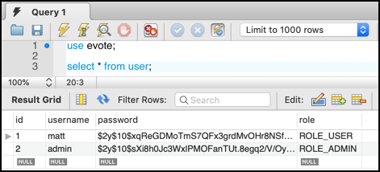

# evote-movie-2020-17-user-roles

Only admin users should be able to create new users. So let's introduce a **ROLE** property for users, allowing us to distinguish between different categories of logged-in users

- add a `role` property to the `User` class, with a default value of `ROLE_USER`:

    ```php
    <?php
    namespace Tudublin;
    
    class User
    {
        const CREATE_TABLE_SQL =
            <<<HERE
    CREATE TABLE IF NOT EXISTS user (
        id integer PRIMARY KEY AUTO_INCREMENT,
        username text,
        password text,
        role text
    )
    HERE;
    
        private $id;
        private $username;
        private $password;
        private $role = 'ROLE_USER';
    
        public function getRole()
        {
            return $this->role;
        }
    
        public function setRole($role)
        {
            $this->role = $role;
        }
    
        public function getId()
        {
            return $this->id;
        }
    
        ... other setters/getters as before
    ```

- update the user fixtures in `/db/migrateAndLoadUserFixtures.php` to define `ROLE_ADMIN` for the `admin/admin` user:

    ```php
    <?php
    require_once __DIR__ . '/../config/dbConstants.php';
    require_once __DIR__ . '/../vendor/autoload.php';
    
    use Tudublin\UserRepository;
    use Tudublin\User;
    
    //--------- MOVIE ---------
    // (1) drop then create table
    $userRepository = new UserRepository();
    $userRepository->dropTable();
    $userRepository->createTable();
    
    // (2) delete any existing objects
    $userRepository->deleteAll();
    
    // (3) create objects
    $u1 = new User();
    $u1->setUsername('matt');
    $u1->setPassword('smith');
    
    $u2 = new User();
    $u2->setUsername('admin');
    $u2->setPassword('admin');
    $u2->setRole('ROLE_ADMIN');
    
    // (3) insert objects into DB
    $userRepository->create($u1);
    $userRepository->create($u2);
    
    // (4) test objects are there
    $users = $userRepository->findAll();
    print '<pre>';
    var_dump($users);
    ``` 

    

- when we check credentials in `LoginController`, rather than returning a Boolean true/false, we'll now return the role string, or an empty string if invalid credentials:

```php
    public function checkCredentials($username, $password)
    {
     $userRepository = new UserRepository();
     $user = $userRepository->getUserByUserName($username);
    
     if($user) {
         $passwordFromDatabase = $user->getPassword();
         $role = $user->getRole();
         if(password_verify($password, $passwordFromDatabase)){
             return $role;
         }
     }
    
     return ''; // invalid, return empty string
    }
```

- when we process a successful user login, we need to store the user's role in the SESSION, as well as their password. We do this in `LoginController` method `processLogin()`:

    ```php
    public function processLogin()
    {
        $username = filter_input(INPUT_POST, 'username');
        $password = filter_input(INPUT_POST, 'password');
    
        $role = $this->checkCredentials($username, $password);
    
        if(!empty($role)){
            // store value in session ...
            $_SESSION['username'] = $username;
            $_SESSION['role'] = $role;
            $mainController = new MainController();
            $mainController->home();
        } else {
            $movieController = new MovieController();
            $movieController->error('bad username or password');
        }
    }
    ```
    
    - if the role returned from `checkCredentials(...)` was not empty, then the user details did match those in the database, and we should store the username and role in the session

- it will be very useful to have a method that gives us the role from the session, so we'll add such a method to our `LoginController`:

    ```php
    /**
     * if we can find a 'role' element in the sesison, return that
     * otherwise return an empty string
     * @return string
     */
    public function roleFromSession()
    {
        if(isset($_SESSION['role'])){
            return $_SESSION['role'];
        }
    
        return '';
    }
    ```
  
- we now need to restrict the processing of new users in the `WebApplication` Front Controller to only users logged in with `ROLE_ADMIN`. This will make use of method `roleFromSession()` that we just created in the `LoginController`:

    ```php
    switch ($action) {
        case 'processNewUser':
            if($loginController->isLoggedIn() && $loginController->roleFromSession() == 'ROLE_ADMIN'){
                $adminContoller->processNewUser();
            } else {
                $movieController->error('you are not authorised for this action');
            }
            break;
    ```
  
- Although the above works, the code is getting a bit complex. Let's add a new method to `LoginController`, where we pass it a role and it returns true/false if the user is logged in with this role. We'll name this method `isGranted(...)`:

    ```php
    public function isGranted($role)
    {
        if($this->isLoggedIn()){
            $roleInSession = $this->roleFromSession();
            if($role == $roleInSession){
                return true;
            }
        }
    
        // if get here, then either not logged in, or didn't have specified role
        return false;
    }
    ```

- now our logic in Front Controller `WebApplicaiton` is much tidier:

    ```php
    switch ($action) {
        case 'processNewUser':
            if($loginController->isGranted('ROLE_ADMIN')){
                $adminContoller->processNewUser();
            } else {
                $movieController->error('you are not authorised for this action');
            }
            break;
    ```
  
- finally, we should not be offering non-ROLE_ADMIN users the link to create a new user. So let's fix this in the base Twig template `/templates/_base.html.twig`:

    ```twig
    <div id="login">
        
            You are logged in as: <b>{{ session.username }}</b>,
            <a href="/index.php?action=logout">logout</a>
    
            
                <br>
                <a href="/index.php?action=newUserForm">CREATE new user</a>
            
    
        
            <a href="/index.php?action=login">login</a>
        
    </div>
    ```
  
    - we have wrapped a Twig `if` around the display of the `CREATE new user` link, testing for `ROLE_ADMIN` stored in the session role
